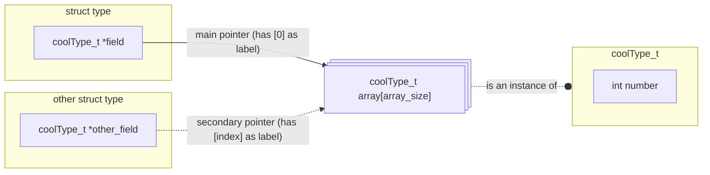
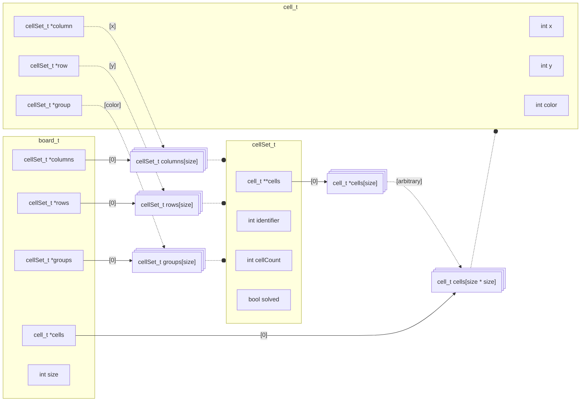

# Queens solver

This is a solver that solves the Queens game on a certain business-oriented social media platform. It is going to be capable of the following things:

- Read the board from a browser window
- Find the queen positions by solving the puzzle
- Placing the queens on the browser window

The game is also called "Star Battle". You can play it on [this website](https://www.puzzle-star-battle.com).


## Types
- A `board_t` holds the pointers to the arrays of `cell_t`s and `cellSet_t`s. It also stores the size of the board (the length of a column or row (which are always equal)).
- A `cellSet_t` is a collection of cells. This is needed, because a queens board is basically just three collections of cells: the columns, rows, and groups. Here, "group" refers to a certain color on the board.
  A `cellSet_t`s cell array is an array of *pointers* to cells in the *board's* cell array. This array gets emptier over time; when the solver finds cells that cannot hold a queen, it removes that cell from all of its sets.
- A `cell_t` is literally just that: a cell. It holds an x, y, and color value. These refer to the cell's x and y coordinates, and its color (obviously). They are also indices in the column, row, and group arrays of the board the cell is in, respectively. It also holds three `cellSet_t` pointers: one for every set it is in (column, row, and group).

I made a mermaid diagram to explain this a bit better maybe. Here is an example of my notation, because if there is an official standard to this, I haven't heard of it:


Ok so here's how the `board_t` structure is set up, after creating one with `createBoard()` and initializing it with `colorBoard()` (it is missing a few fields that aren't important right now):



## Files

- [Makefile](./Makefile) is the makefile used to build the project
- [looker.c](looker.c)/[looker.h](looker.h) gets the browser window and puts it into an array. Currently only works for X11 GNU/Linux systems.
- [seeer.c](seeer.c)/[seeer.h](seeer.h) uses the array retrieved by the looker, and detects the queens board on it.
- [types.c](types.c)/[types.h](types.h) defines a `board_t` object, which holds `cell_t` and `cellSet_t` objects. These have a *lot* of pointer bs going on.
- [solver.c](solver.c)/[solver.h](solver.h) uses a `board_t` object and solves it (finds the queens).
- [main.c](main.c) is the main file. Parses arguments and runs the functions from the other files.
- [games](./games) is a folder that holds a bunch of predefined games to test the solver on.


## The solver
The solver applies a number of simple techniques to quickly simplify a board. It does so repeatedly, until it cannot find any more changes to make (changes being cells being crossed off or marked as queen).
After this, it runs a bruteforcing algorithm to completely solve the board.

### Techniques
The following techniques are applied:
1. Check if a set has only 1 cell. Mark it as queen if it does.
2. When a cell is marked as queen, the cells in its sets are crossed, as well as the cells adjacent to the queen.
3. Check, for every cell, if it would completely block a set if it were a queen.

Most boards can actually be solved using only these three techniques.

### Bruteforcing
"Bruteforcing" is honestly a bit of a harsh name for what actually happens.
It is a recursive function that basically does the following:

Start with the first **group** (a group is a set of same-coloured cells).
- For every **cell** in that **group**:
  - Check if placing a queen here would completely block a set (using the same function as technique number 3)
    - If so: go to the next **cell**   
    - If not:
      - Make a copy of the board
      - Place a queen on the **cell** in the copied board
      - Run the bruteforcing function with this copied board, but this time use the *next* **group**

This way, it checks all possible queens positions rather efficiently. So efficiently in fact, that I'm actually not sure if using the techniques described in [Techniques](#techniques) make the program more efficient, or are actually slowing it down. I can, however, not be bothered to check this.


> ignore the next part, I'm taking notes in a car
# VCD to SVG converter
This is a program that will eventually be able to generate a diagram from a VCD input. It is written in C without any parser libraries because I am a masochist. I wrote this for the 5 people on this planet that, like me, *hate* it when they have to include a screenshot of a GTKWave/ModelSim waveform into a report. There are going to be a few settings you can adjust. Usage will be as follows:

```bash
./vcd2svg [OPTIONS] INPUT [OUTPUT]
```
Here, INPUT is the input file, and output the output file (wow). The placement of the options doesn't matter you can place those anywhere. If no output file is provided the SVG output will be dumped to stdout for easy piping. The following options are available:

* `-s, --signals=SIGNALS` 
* `-m, --margin=MARGIN`\
Set the vertical margin between waves. A MARGIN of 0 will make the waves kiss. Default is **idk**.

* `-f, --force` do not prompt before overwriting.
* `-F, --hard-force` do not prompt anything. Useful for piping. Will supress warnings like "this diagram will be absurdly long, are you sure?"